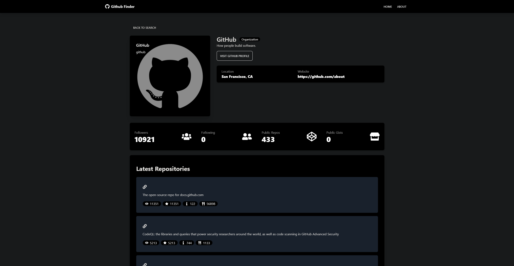

# Github Finder

This is a React app to search github user profiles and see profile details.

## How It's Made:

The app uses the github api to get lists of users and user repos

**Tech used:**
HTML, CSS - Tailwind/DaisyUI, JavaScript - JSX, React

**Preview:**

    

**Website:**
https://github-finder-sepia-three.vercel.app/

## Optimizations:

Will come back to refactor calls into action files.

## Lessons Learned:

Learned more on how to use the context api and reducers to manage global state. Learning deploys with vercel
